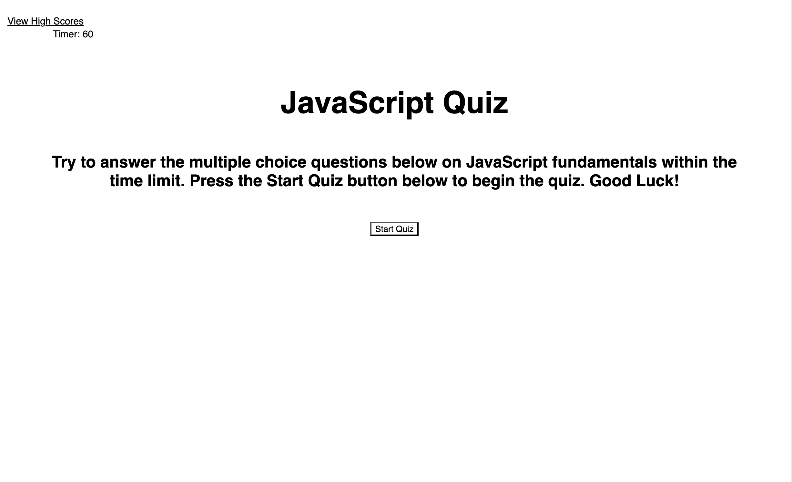
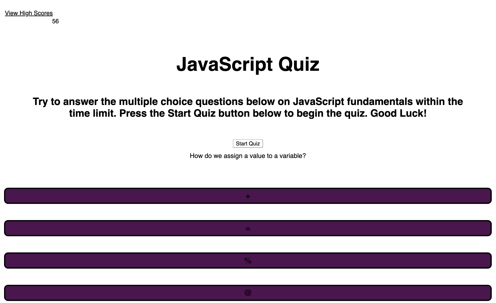

# name-that-javascript-fundamental
A timed coding quiz on the fundamentals of JavaScript.

## Description
- The motivation for this project was Javascript and Web API's to create a timed quiz on the fundamentals of JavaScript. Implementating and practicing JavaScript and Web API's is subsequently motivation for this project. 
- This project utilizes HTML, CSS, JavaScript and Web API's. HTML and CSS provide the structure and styling of the page and JavaScript and Web API's in order to go through the carousel of questions and provide the interavtivity of the webpage. 
- Many challenges arose while making this project, time being the biggest challenge. A lack of time to work on the project and the code being time consuming to write. I underestimated the amount of time needed to work on all the features of this project and to get them functioning properly.  
- Also, when the correct answer is selected the corresponding, "That's correct!" is not showing, instead only, "Incorrect," appears. As well, upon linking the High Scores page the styling was lost, along with the styling of the timer. 
- During the building of this project I learned a lot about JavaScript functions and utilizing a timer during the process.

## Usage
- To take this quiz, the user can access the webpage by placing the URL in a browser. The webpage does not require any authentications, like a password.
- The quiz starts once the 'Start Quiz' button is clicked and the user then has one minute, or 60 seconds, to select the answer from the multiple choice options provided. 
- The slection choices for the answer to each quesrtion appear when the user hoovers over each button and the text colour changes form black to whie. 
- After all the questions have been answered, the user can enter their initials and submit those initials.
- After submitting their initials, the user can view the high scores and/or go back to the homepage of the quiz, where the 'Start Quiz' button is accessible again.

- Screenshots of URL open in browser

- Link to deployed application 
[x][y]

## License
- There is no license for this project.

## Credits

Atif, K. (2023). Coding Quiz. GitHub [Source Code]. https://github.com/kaitlynatif/Coding_Quiz.git

Compton, R. (2020). Quiz Game. GitHub [Source Code]. https://github.com/comp7589/HW-4---Quiz-Game.
Create a Quiz App with Timer using HTML CSS and JavaScript. (2023, October 05). Geeks for Geeks. Retrieved January 28, 2024 from https://www.geeksforgeeks.org/create-a-quiz-app-with-timer-using-html-css-and-javascript/

Hernandez, S. [Santiago Hernandez]. (n.d.). I need to make a high-score list for this Javascript game. [Online forum post]. Stack Overflow. https://stackoverflow.com/questions/74064513/i-need-to-make-a-high-score-list-for-this-javascript-game 

Hillary Nyakundi, H. (2021, December 08). How to Write a Good README File for Your GitHub Project. FreeCodeCamp. https://www.freecodecamp.org/news/how-to-write-a-good-readme-file/

Tigalo, J. (2022). Coding Quiz Challenge  GitHub [Source Code]. https://github.com/jbtiglao/code-quiz-challenge.git

University of Toronto. (2023). Coding Boot Camp [Source Code].

Wayne, A. [Alex Wayne]. (2018, November 12). How to save highscores in javascript game? [Online forum post]. Stack Overflow. https://stackoverflow.com/questions/53270460/how-to-save-highscores-in-javascript-game

Web Dev Simplified [Web Dev Simplified]. (2019, June 15). Build A Quiz App With JavaScript [Video]. YouTube. https://www.youtube.com/watch?v=riDzcEQbX6k